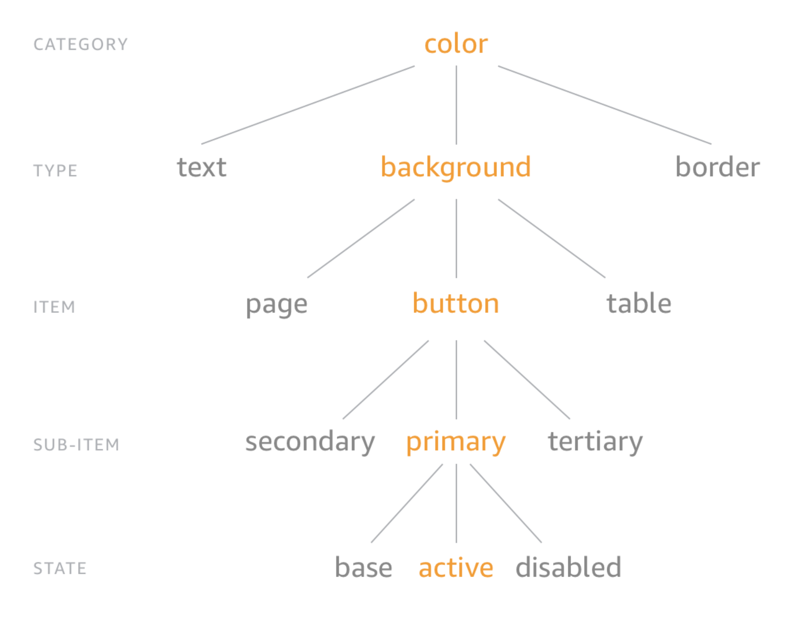

# Structure

## Built-in categories

### color

Everything under this category is a color. You can further organize by background, font, border, etc. if you want. The built-ins only look for a category of color

### size

Most platforms any type of size is treated the same. On Android it is common to use SP for font sizes and DP for paddings and dimensions.

### time

Number in milliseconds

### asset

These should be file paths used for images and font files

### content

These should be strings
